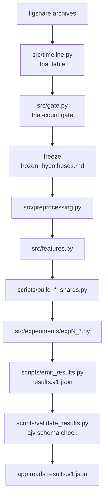

# Can Your Brain Learn a Liar?

When two people repeatedly deceive each other, does the brain learn the patterns of its specific opponent?

We analyzed simultaneous EEG from 12 interacting pairs to test whether deception signatures are universal, person-specific, or relationship-specific.

[](https://doi.org/10.6084/m9.figshare.24760827)
[](https://doi.org/10.6084/m9.figshare.24760827)
[](requirements.txt)
[](app/package.json)


## Live walkthrough

**[nsp-liars.albert14059.workers.dev](https://nsp-liars.albert14059.workers.dev/)**

To run it locally instead:

```bash
cd app
npm install
npm run dev
```

Then open the printed `localhost` address. The app reads `results/results.v1.json` directly and performs no inference at load time, so this works offline once you have the repo.

## Table of contents

- [About](#about)
- [Headline finding](#headline-finding)
- [Results at a glance](#results-at-a-glance)
- [The dataset](#the-dataset)
- [How the results were produced](#how-the-results-were-produced)
- [Reproducing it](#reproducing-it)
- [Repository map](#repository-map)
- [What this project does not claim](#what-this-project-does-not-claim)
- [Licence and attribution](#licence-and-attribution)

## About

Two people play a competitive game with role-switching. One deceives, one observes, and their EEG is recorded at the same time. That simultaneity is the point: it lets us ask whether a lie shows up in the deceiver's brain, whether the observer's brain responds to it too, and whether either signal changes shape as the pair keeps interacting.

The project tests three hypotheses in order, each building on the last.

**H1, universal.** Deception-related EEG patterns are the same across people. A model trained on most participants should predict deception in a participant it has never seen.

**H2, person-specific.** Different people have different deception-related patterns. A model trained on a person's own past trials should beat a population model trained on everyone else.

**H3, relationship-specific.** This is the project's main hypothesis. Repeated interaction makes neural responses specific to a particular pair, not just to the individual. A model that has seen this exact dyad interact before should beat one that has only seen the person's own history.

The dyad is the unit of analysis throughout, not the trial. Twelve pairs is a small sample for population statistics, but it is the natural unit for a question about relationships: each pair, not each trial, is one independent observation of whether relationship-specific learning happens. Every headline number in this project is a paired comparison across dyads, tested with a sign test and a paired permutation test, not a difference between two pooled accuracies.

The dataset makes this question askable at all because both players are recorded simultaneously. Most EEG deception work has one brain per session; here there are two, so the observer's decodability and the dyad's shared history become measurable alongside the deceiver's own signal.

## Headline finding

**H3 was not supported.** Dyad-specific history did not beat person-specific or population-level models. `results/frozen_hypotheses.md` pre-wrote both possible conclusions before any model was fit; the "not supported" paragraph is the one that applies:

> Despite repeated interaction, dyad-specific history did not significantly improve prediction beyond participant-specific or population-level models. Across 12 dyads the paired differences were centered near zero, and the effect was not consistent in direction. This suggests that deception-related EEG patterns in this dataset are more strongly driven by individual or general neural characteristics than by relationship-specific adaptation.

The numbers behind it, from [`results/exp4_dyadic.md`](results/exp4_dyadic.md): median DyadGain = **−0.0185** across 10 dyads, 2 of 10 positive, sign-test p = 0.1094, permutation p = 0.05179, 95% CI [−0.0304, −0.0028]. The confidence interval sits on the negative side of zero. Dyad-specific history did not help, and if anything the point estimate leans the wrong way.

A pre-registered null is not a failed project here. Both outcomes were written down and locked in `results/frozen_hypotheses.md` before a single model was fit (§8, `can_your_brain_learn_a_liar_workflow.md`), so this result is reported exactly as planned.

<details>
<summary>Why n = 10, not 12</summary>

The pre-registered design covered 11 dyads for exp4 (`sub01_sub02` is excluded from experiments requiring both roles per dyad, because one participant in that pair never appears as a deceiver in the archive). A twelfth dyad, `sub19_sub22`, turned out to be structurally untestable at dyad grain: its only deceiver-role participant's data falls entirely in the block exp4 needs for training, not testing. This was discovered from the data's structure before any exp4 model was fit and is recorded as Amendment 1 in `results/frozen_hypotheses.md`, not decided after seeing results.

</details>

## Results at a glance

| Experiment | What it tests | Result | Source |
|---|---|---|---|
| Exp 1, baseline | Pooled single-trial decoding, upper bound, not a generalization claim | LR AUROC 0.534 [0.526, 0.541] | [exp1_baseline.md](results/exp1_baseline.md) |
| Exp 2, universal (H1) | Leave-one-dyad-out over 12 dyads | mean AUROC 0.5131; permutation p = 0.0547; 2.1 points below exp1's pooled number | [exp2_universal.md](results/exp2_universal.md) |
| Exp 3, personalized (H2) | Personalized model vs population model | median delta +0.0320, 8 of 11 dyads positive, sign p = 0.2266, permutation p = 0.1233 | [exp3_personalized.md](results/exp3_personalized.md) |
| Exp 4, dyadic (H3, primary) | Dyad-specific model vs person-specific model | median DyadGain −0.0185, 2 of 10 positive, sign p = 0.1094, permutation p = 0.05179 | [exp4_dyadic.md](results/exp4_dyadic.md) |
| Exp 5, history | Does decodability grow with interaction history | median +0.0136, 8 of 10 positive, sign p = 0.1094, permutation p = 0.1718 | [exp5_history.md](results/exp5_history.md) |
| Exp 6, observer | Observer-only decoding, early vs late in the interaction | median +0.0238, 6 of 10 positive, sign p = 0.7539, permutation p = 0.4043; absolute decodability 0.5054 vs null 0.4999, p = 0.1767 | [exp6_observer.md](results/exp6_observer.md) |
| Exp 7, input sets | One brain vs two brains | both-brains minus deceiver-only median +0.0073, 7 of 11 positive, sign p = 0.5488, permutation p = 0.2887, not supported | [exp7_input_sets.md](results/exp7_input_sets.md) |

Every number in this table is copied from the linked file, not recomputed for the README. If a number here ever disagrees with its source file, the source file is correct.

Seven experiments shipped with results. An eighth, onset timing (when in a trial does the deceptive signal first become decodable), was designed in detail and frozen as Amendment 5 of `results/frozen_hypotheses.md`, but its run was not completed and does not appear in `results/results.v1.json`.

## The dataset

[An EEG Dataset of Neural Signatures in a Competitive Two-Player Game Encouraging Deceptive Behavior](https://doi.org/10.6084/m9.figshare.24760827), Chen, Wallraven & Fazli, figshare, CC BY 4.0.

- 12 participant pairs, 24 participants total
- Simultaneous EEG, 30 channels per player
- A competitive deception game with role-switching between deceiver and observer

<details>
<summary>Archive contents and sizes</summary>

| File | Size |
|---|---:|
| `Raw.zip`, raw EEG | 5 GB |
| `Preprocessed.zip`, preprocessed EEG | 1.35 GB |
| `OneDCNN.zip`, data pre-formatted for 1D-CNN classification | 1.36 GB |
| `behavioral log and trigger timestamp.zip` | 1.46 MB |
| `readme.txt` | 2.12 kB |
| `Participant information and risk taking tendency.xlsx` | 9.04 kB |
| **Total** | **7.71 GB** |

</details>

None of this is in the repo. `.gitignore` excludes everything under `data/` except the small text notes below and `data/raw/readme.txt`, because 7.7 GB does not belong in git. Reproducing the pipeline means downloading the archives yourself (see [Reproducing it](#reproducing-it)).

## How the results were produced



Each `expN_*.py` module writes its own fragment, `results/expN_*.json` and `.md`. Nothing downstream of the freeze step changes what an experiment measures; `scripts/emit_results.py` only merges the already-computed fragments into one file.

The pre-registration discipline that makes the headline finding meaningful: the trial-count gate ran before any model was fit, to decide in advance which experiments had enough data to trust (`results/trial_count_gate.md`); the three hypotheses and the primary metric were frozen immediately after (`results/frozen_hypotheses.md`), before a single model touched the data; and every later change to that frozen file is an appended, dated amendment with its own reason, rather than a silent edit. Five amendments exist, all pre-results, mostly excluding one structurally untestable dyad (`sub19_sub22`) from specific experiments where its data falls entirely outside the block that experiment needs.

<details>
<summary>Exact command sequence</summary>

Run from the repo root, after the download step in <a href="#reproducing-it">Reproducing it</a>.

```bash
python src/timeline.py
python src/gate.py
# inspect results/trial_count_gate.md and results/frozen_hypotheses.md here
python src/preprocessing.py
python src/features.py

python scripts/build_dyadic_shards.py
python scripts/build_observer_shards.py
python scripts/build_onset_shards.py
python scripts/build_onset_windows.py

python src/experiments/exp1_baseline.py
python src/experiments/exp2_universal.py
python src/experiments/exp3_personalized.py
python src/experiments/exp4_dyadic.py
python src/experiments/exp5_history.py
python src/experiments/exp6_observer.py
python src/experiments/exp7_input_sets.py

python scripts/emit_results.py
python scripts/validate_results.py results/results.v1.json
```

exp4, exp5, and exp6 read parquet shards built by the `build_*_shards.py` scripts above instead of the full feature table. The project's own exp4 through exp6 fragments were originally produced on a second machine with an older Python/scikit-learn combination (3.8 / 1.3.2, versus this repo's pinned 3.13 / 1.8.0); a documented drift check found a maximum AUROC difference of about 0.015 between the two environments, reported in each experiment's `.md` file. Running the same commands under `requirements.txt`'s pinned versions is expected to reproduce results within that same small margin, not bit-for-bit.

exp7 also accepts `--dry-run` and `--smoke` flags for a fast structural check before committing to a full run.

</details>

## Reproducing it

**Prerequisites:** Python 3.13 (see `requirements.txt` for packages: pandas, numpy, scipy, pyarrow, scikit-learn, xgboost, torch, jsonschema, openpyxl), Node 18 or later, and a figshare account to download the dataset.

```bash
python -m venv .venv
source .venv/bin/activate  # .venv\Scripts\activate on Windows
pip install -r requirements.txt
```

**Download the archives.** Get `Preprocessed.zip`, `behavioral log and trigger timestamp.zip`, and `Participant information and risk taking tendency.xlsx` from the [figshare page](https://doi.org/10.6084/m9.figshare.24760827) and extract them under `data/raw/`. `OneDCNN.zip` is only needed for exp1's CNN sanity check. `Raw.zip` is not needed unless you are re-deriving preprocessing from scratch; skipping it saves 5 GB.

**Run the pipeline.** See the [command sequence](#how-the-results-were-produced) above. Expect several minutes for the shard-building and experiment steps; exp2 through exp7 each fit dozens of per-dyad models.

**Validate the output.**

```bash
python scripts/validate_results.py results/results.v1.json
```

```bash
cd app && npm install && npm run validate:results
```

Both check `results/results.v1.json` against `results/schema/results.v1.schema.json`; the second additionally exercises the exact ajv invocation the app's own scripts use.

**Run the app.**

```bash
cd app
npm install
npm run dev
```

`npm run gen:types` regenerates `app/src/types/results.v1.d.ts` from the schema after a schema change; the app does not run it automatically.

**What's pinned vs exploratory.** The model families (logistic regression, SVM, random forest, gradient boosting), the feature set (reliable-plus-marginal EEG bands, 1,770 columns), and every fold structure are fixed in `results/frozen_hypotheses.md` and the per-experiment `.md` files before any number was computed. The 1D-CNN in exp1 is a one-off feature-adequacy check; it does not feed exp2 through exp7 or the app.

## Repository map

```text
README.md                        this file
requirements.txt                 Python dependencies
wrangler.jsonc                   Cloudflare Workers static-asset config

src/
  timeline.py                    trial table reconstruction
  gate.py                        trial-count go/no-go gate
  preprocessing.py                EEG windowing
  features.py                    EEG, behavioral, inter-brain feature extraction
  models.py                      shared model families and metrics
  cnn_check.py                   exp1's 1D-CNN sanity check only
  experiments/
    exp1_baseline.py … exp7_input_sets.py   one module per shipped experiment
    exp8_onset.py                 onset-timing design, not run to completion
    exp9_trial_predictions.py     per-trial prediction export

scripts/
  build_dyadic_shards.py         per-dyad parquet shards for exp4
  build_observer_shards.py       per-dyad observer shards for exp6
  build_onset_shards.py          shards for exp8 (unused, exp8 incomplete)
  build_onset_windows.py         onset window feature extraction (unused)
  build_fixture.py               hand-written fixture for frontend development
  emit_results.py                merges expN fragments into results.v1.json
  validate_results.py            ajv-equivalent schema check, standalone
  extract_exp1_null.py           extracts exp1's permutation null for reuse

results/
  results.v1.json                the frozen artifact the app reads
  schema/results.v1.schema.json
  fixtures/results.v1.fixture.json   fake numbers, for frontend dev only
  frozen_hypotheses.md           H1/H2/H3, primary metric, five amendments
  trial_count_gate.md            the go/no-go gate and its rationale
  exp1_baseline.md … exp7_input_sets.md   one report per shipped experiment
  exp9_trial_predictions.json    per-trial predictions, no markdown summary

data/
  raw/readme.txt                 the only tracked file under data/raw/
  processed/*.md                 preprocessing, feature engineering, and
                                  onset-window notes (the parquet/csv files
                                  next to them are gitignored)

exp2_colab/exp2_colab.ipynb      exp2's Colab notebook

app/                             React + TypeScript + Tailwind judge-facing walkthrough
  src/data/source.ts             the app's one point of contact with results.v1.json
  src/walkthrough/               the per-experiment walkthrough screens
  src/components/                chart components (PairedDotPlot, LearningCurve, ...)
```

## What this project does not claim

- The model does not read thoughts.
- It is not a real-world lie detector, and it does not determine whether arbitrary people are lying.
- EEG classification in this controlled experiment is not evidence about deception outside the experimental setting.
- Inter-brain synchrony, where measured, is a statistical relationship between two recordings, not proof of direct brain-to-brain communication.
- Twelve dyads is a small sample; results require cautious interpretation, and every experiment the trial-count gate found underpowered is labelled exploratory rather than reported as a finding.
- Exp6's observer-only decoding shows the observer's brain responds differently to lie and truth trials. That is consistent with the observer detecting something, but equally consistent with the observer's brain tracking the deceiver's own behavioral tells (pauses, prosody, timing) rather than the deception itself. Exp6 alone cannot tell these apart, and does not claim to.

## Licence and attribution

The dataset is CC BY 4.0, attributed to Chen, Wallraven & Fazli (figshare, [10.6084/m9.figshare.24760827](https://doi.org/10.6084/m9.figshare.24760827)). Cite it if you reuse the data.

This repository's own code does not yet have a licence file. Treat it as "all rights reserved" until one is added.
